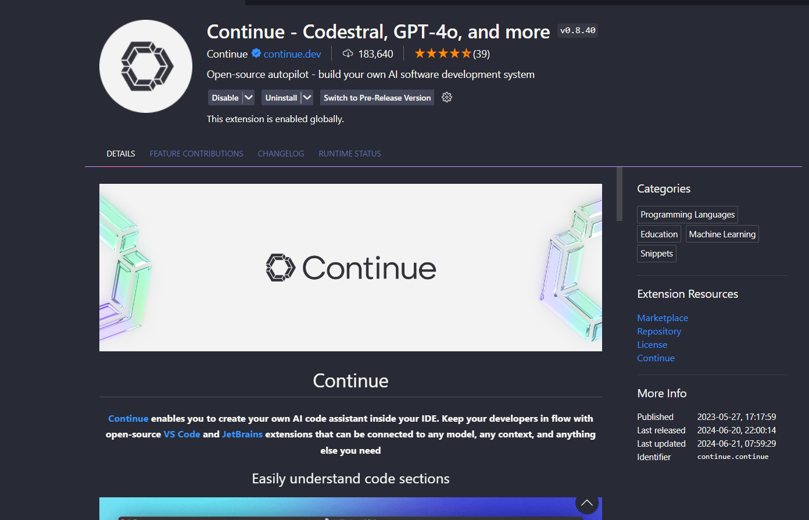

Não é novidade que a Inteligência Artificial está em alta, trazendo consigo uma série de ferramentas para facilitar o dia a dia em diversas áreas.
No mundo da programação, uma das grandes inovações é o GitHub Copilot, desenvolvido com a ajuda da OpenAI.

No entanto, o Copilot é uma ferramenta paga e não oferece garantias sólidas de privacidade dos seus dados.

Felizmente, existem alternativas gratuitas que proporcionam resultados semelhantes.
Uma excelente combinação é o Ollama, junto com a extensão Continue para o Visual Studio Code (VSCode).

Siga o passo a passo abaixo para instalar e configurar o Ollama e a extensão Continue no VSCode:

## 1. Instalação do Ollama

Ollama é uma ferramenta open source para executar LLMs localmente no seu computador.
É possível rodar modelos como: Llama 3, Phi 3, Mistral, Gemma, etc.
Para ver a listagem completa acesso a página de [modelos](https://www.ollama.com/library)

Para instalar Ollama, siga as instruções no site oficial: https://www.ollama.com

## 2. Instalação da extensão Continue

Após a instalação do Ollama, é necessário configurar a extensão Continue na IDE.

Na aba de extensões do VsCode, procure por [**Continue**](https://marketplace.visualstudio.com/items?itemName=Continue.continue) e clique em **Instalar**.



Ao instalar a extensão, sera necessário rodar os modelos do ollama. Isso pode ser feito no próprio VsCode na aba do Continue.

1. Selecione a aba **Continue** e clique em **Local Models**.

2. Rode os modelos do Ollama. Neste caso usaremos o Llamma3 para chat e o starcoder2 para gerar código.

```bash
ollama run llama3
```

```bash
ollama run starcoder2:3b
```

3. Após a execução dos modelos, você está pronto para usar o Continue.

**Obeservação:** Também é possivel usar outros modelos, para mais informações acesse a documentação oficial do [Continue](https://docs.continue.dev/setup/configuration)

## 3. Começe a usar!

Depois de tudo configurado é só usar. Além de te ajudar a escrever, gerar e explicar código,
o Continue também consegue aprender com o seu codebase para dar sugestões mais precisas.

Abaixo está listado alguns exemplos de uso junto com uma demostração.

### Conversando via Chat

Assim como o ChatGPT, podemos usar o Chat para conversar com o assistente IA.


### Geração de código com um simples prompt

Além de fazer perguntas, o assistente IA também pode gerar código para você.


### Escreva código com ajuda do auto complete e economize tempo

E claro, o assistente IA também pode ajudar a escrever ou te explicar o código.


Não deixe de conferir a documentação e blog oficial do [Ollama](https://www.ollama.com/blog/continue-code-assistant) e do [Continue](https://www.continue.dev/)
para saber mais sobre como usar o assistente IA em diferentes aplicativos e linguagens de programação.
