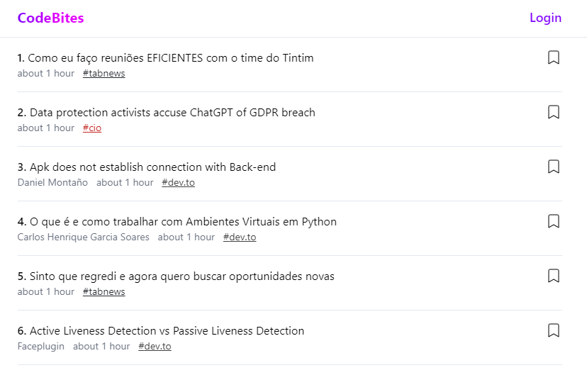

**Overview do Projeto:**
[CodeBites](https://www.codebites.dev/) é um Tech Blog Agregator, todos os seus blogs de tecnologia em um unico lugar!
Para consumir os posts utilizamos feeds RSS como base, sendo possível configurar novos blogs sem necessidade de novo deploy.

## Objetivos

1. Concetrar blogs de technologia em apenas um lugar
2. Facilitar a descoberta de novos blogs e post relevantes
3. Concetrar os bookmarks dos usuarios em um lugar apenas

## Stack

- Frontend & Backend: Next.Js
- Database: Neon PostgresSQL.
- Clerk: Autenticação
- Analytics: Google
- CronJob Manager: Mergent

## Features

1. **Login com Github**

    Uma aplicação feita para Devs não podia deixar de ter login com github

2. **Bookmarks**

    Disponivel apenas para usuários logados
    Permite o usuário guardar os posts que mais gostou para visulizar posteriomente

3. **Lista Infinita de Posts**

    Com o intuito de prover a melhor experiência o site conta com o Scroll Infinito,
tendo assim uma navegação simples e efetiva

4. **Filtros**

    Com apenas um clique filtre os posts de um blog específico

